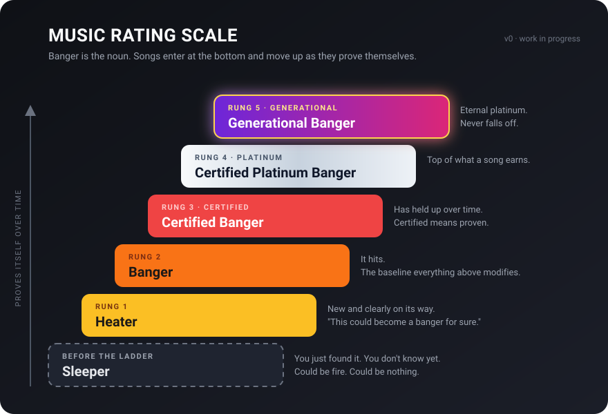

# Music Rating Scale

<p align="center">
  
</p>

## The ladder

| # | Full name | Short | Meaning |
|---|---|---|---|
| 0 | **Sleeper** | | Before the ladder. You just found it and don't know yet. Could be fire. |
| 1 | **Heater** | | New and clearly on its way. "This could become a banger for sure." |
| 2 | **Fire** | | Past heater. Not yet a banger. |
| 3 | **Banger** | | It hits. It really hits. |
| 4 | **Certified Banger** | Certified | Unmistakingly a banger. Anyone who doubts this is a banger doesn't have ears |
| 5 | **Certified Platinum Banger** | Platinum | Top of what a song earns. Very, very rare |
| 6 | **Generational Banger** | Generational | Eternal platinum. Never falls off. Certification is baked in. |

## How songs move

- A song you have just found and think might have potential is a **Sleeper**. This is used when a song is in 
an uncertain place. This song has _potential_ to someday become something.
- Songs _generally_enter the ladder as a **Heater** and move up as they prove themselves:
  Heater, Fire, Banger, then the certified tiers. Very few songs become certified, so use this sparingly.
- **Platinum** is the top of what a song can earn. **Generational** is a Platinum
  that will never fall off.

## Example

- "Don't Stop Believing" by Journey: Generational Banger.

## Open questions

Candidate names are suggestions, not decisions.

1. **A song that is just not good.** Candidates: **Brick** (cold, and a missed
   shot), **Cold**, **Dud**.
2. **A song that is overrated.** Candidates: **Fool's Gold** (looks certified,
   isn't), **Counterfeit**, **Overcooked**.
3. **What "certified" means concretely.** Time held, listen count, or still hits
   on a cold listen after a long break.
4. **"Certified Generational Banger."** Emphasis, or a distinct thing?

<details>
<summary>Text versions of the ladder</summary>

```text
  ┌──────────────────────────────┐
  │     Generational Banger      │   rung 6, eternal platinum
  ├──────────────────────────────┤
  │  Certified Platinum Banger   │   rung 5, top of what a song earns
  ├──────────────────────────────┤
  │       Certified Banger       │   rung 4, has held up
  ├──────────────────────────────┤
  │            Banger            │   rung 3, it hits
  ├──────────────────────────────┤
  │             Fire             │   rung 2, past heater
  ├──────────────────────────────┤
  │            Heater            │   rung 1, on its way
  └ ─ ─ ─ ─ ─ ─ ─ ─ ─ ─ ─ ─ ─ ─ ─┘
  ╎           Sleeper            ╎   before the ladder, don't know yet
  └ ─ ─ ─ ─ ─ ─ ─ ─ ─ ─ ─ ─ ─ ─ ─┘
```


</details>
